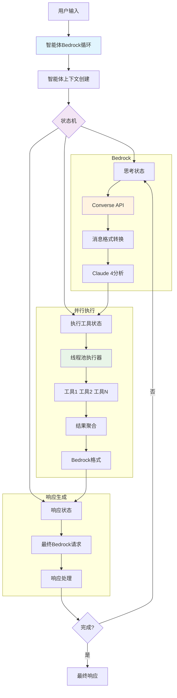
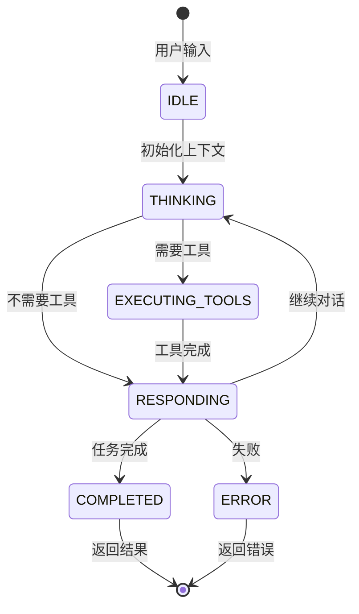
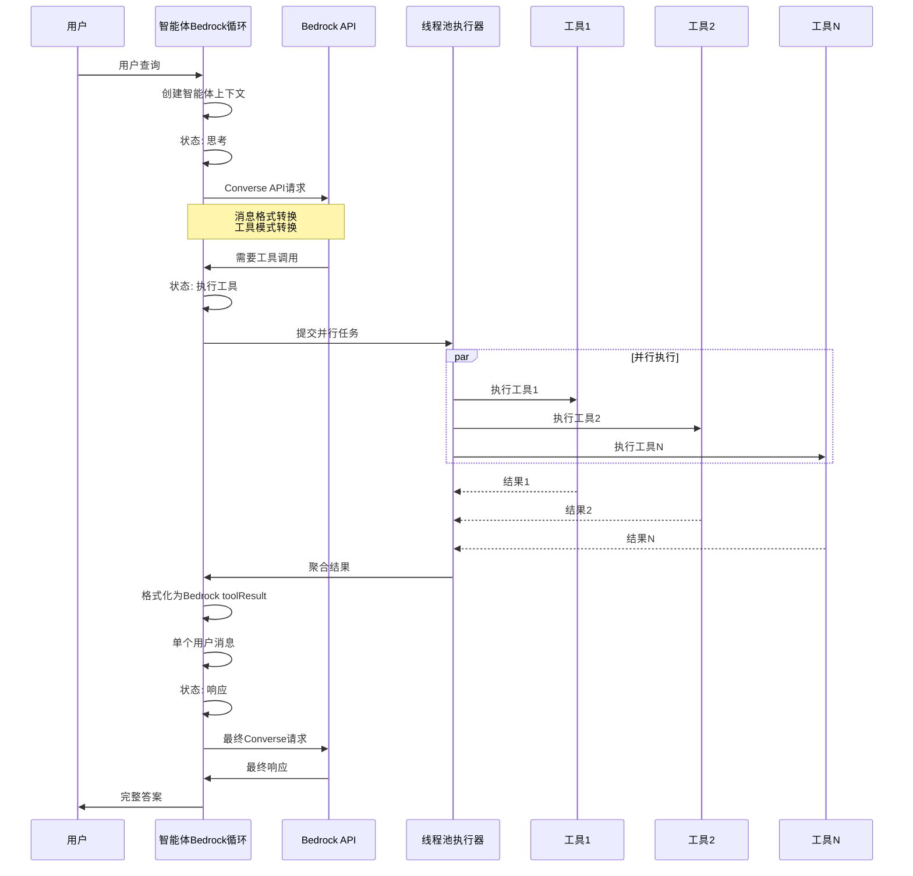

# Claude 4 并行工具执行：构建高性能AI智能体

*通过Amazon Bedrock Converse API与Claude 4模型的并发工具执行和复杂事件循环，释放AI智能体的全部潜力*

## 引言

AI智能体的发展已经到达了一个关键时刻，Claude 4模型引入的并行工具执行能力标志着这一转折点。这项突破性技术彻底改变了AI系统与外部工具的交互方式，从顺序执行、耗时的操作转变为在复杂智能体架构中的闪电般快速并发执行。

但并行工具执行不仅仅是更快的单个请求——它是构建高级智能体系统的基础，这些系统能够维护上下文、做出决策、执行复杂的多步骤工作流，并通过智能线程池管理在多次迭代和状态转换中优化资源使用。

在这份综合指南中，我们将探索如何使用**直接Amazon Bedrock Converse API实现智能体事件循环**，该循环利用并行工具执行与可重用线程池、状态管理和自适应决策制定，创建真正智能的AI智能体，能够处理复杂的多迭代工作流，同时最大化性能和资源效率。

## 并行工具执行革命

### 什么是智能体系统中的并行工具执行？

智能体系统中的并行工具执行允许AI模型在维护上下文和跨多个推理周期状态的同时调用多个工具。当智能体需要"分析代码质量、运行测试、检查依赖项和生成文档"时，智能体可以在当前状态内同时处理所有工具，而不是跨多次迭代顺序执行这些任务，同时为未来决策制定保留上下文。

### 模型兼容性：Claude 4的优势

**重要提示**：并行工具执行仅由最新的Claude模型支持：

- **Claude 4 Sonnet** (`anthropic.claude-sonnet-4-20250514-v1:0`)
- **Claude 4 Opus** (`anthropic.claude-opus-4-20250514-v1:0`)
- **Claude 4.1 Opus** (`anthropic.claude-opus-4-1-20250805-v1:0`)
- **Claude 3.7 Sonnet** (`anthropic.claude-3-7-sonnet-20250219-v1:0`)

早期的Claude模型（3.5 Sonnet、3 Haiku等）不支持此功能，将顺序执行工具。这使得升级到Claude 4模型对于构建高性能智能体系统至关重要。

## 直接Bedrock智能体架构

### 系统架构概览



### 状态转换流程



### 并行工具执行架构


### 高级Bedrock智能体方法

我们的实现使用直接Amazon Bedrock Converse API与复杂的智能体架构、可重用线程池和全面的状态管理：

```python
class AgenticBedrockLoop:
    """使用直接Bedrock Converse API的智能体事件循环"""
    
    def __init__(self, aws_region: str = "us-east-1", max_workers: int = 8):
        # 带重试配置的直接boto3 Bedrock客户端
        retry_config = Config(
            retries={'max_attempts': 10, 'mode': 'adaptive'},
            read_timeout=300, connect_timeout=60
        )
        
        self.client = boto3.client(
            'bedrock-runtime',
            region_name=self.aws_region,
            config=retry_config
        )
        
        self.model = "us.anthropic.claude-sonnet-4-20250514-v1:0"
        self.executor = None  # 在整个智能体生命周期中可重用
        
    async def run_agent(self, user_message: str) -> Dict[str, Any]:
        """使用Bedrock Converse API执行智能体"""
        context = AgentContext(
            conversation_id=f"bedrock_{datetime.now().strftime('%Y%m%d_%H%M%S_%f')}",
            messages=[{"role": "user", "content": user_message}],
            events=[], current_state=AgentState.IDLE, tool_results=[]
        )
        
        while (context.current_state != AgentState.COMPLETED and 
               context.current_state != AgentState.ERROR):
            
            if context.current_state == AgentState.THINKING:
                await self._handle_thinking_bedrock(context)
            elif context.current_state == AgentState.EXECUTING_TOOLS:
                await self._handle_tool_execution(context)
            elif context.current_state == AgentState.RESPONDING:
                await self._handle_responding_bedrock(context)
```

### Bedrock消息格式转换

实现处理标准消息格式和Bedrock特定要求之间的转换：

```python
async def _handle_thinking_bedrock(self, context: AgentContext):
    """使用Bedrock Converse API处理思考状态"""
    
    # 将消息转换为Bedrock格式
    bedrock_messages = []
    for msg in context.messages:
        if msg['role'] == 'user':
            if isinstance(msg['content'], str):
                bedrock_messages.append({
                    'role': 'user',
                    'content': [{'text': msg['content']}]
                })
            else:
                bedrock_messages.append({
                    'role': 'user', 
                    'content': msg['content']
                })
    
    # 将工具模式转换为Bedrock格式
    bedrock_tools = []
    for tool in TOOL_SCHEMAS:
        bedrock_tool = {
            'toolSpec': {
                'name': tool['name'],
                'description': tool['description'],
                'inputSchema': {'json': tool['input_schema']}
            }
        }
        bedrock_tools.append(bedrock_tool)
    
    response = self.client.converse(
        modelId=self.model,
        messages=bedrock_messages,
        toolConfig={'tools': bedrock_tools},
        inferenceConfig={'maxTokens': 4000}
    )
```

### 线程池管理

```python
def __enter__(self):
    # 为整个智能体生命周期创建一次线程池
    self.executor = concurrent.futures.ThreadPoolExecutor(
        max_workers=self.max_workers,
        thread_name_prefix="AgentToolExecutor"
    )
    return self

async def run_agent(self, user_message: str) -> Dict[str, Any]:
    """使用可重用线程池运行完整的智能体事件循环"""
    context = AgentContext(...)
    
    while (context.current_state != AgentState.COMPLETED and 
           context.iteration_count < context.max_iterations):
        
        # 基于上下文和结果确定下一状态
        next_state = await self._determine_next_state(context)
        await self._transition_state(context, next_state)
        
        # 执行状态处理器（可能使用并行工具）
        await self.state_handlers[context.current_state](context)
```

## 高级并行工具执行

- **多迭代优化**：单个线程池服务整个智能体生命周期
- **基于状态的架构**：思考 → 执行工具 → 规划 → 响应
- **资源效率**：迭代间无线程池创建开销
- **复杂工作流**：支持多步推理和自适应决策制定
- **上下文保持**：在智能体迭代间维护状态和内存

## 实现深入解析

### 智能体事件循环架构

我们的实现在复杂的基于状态的智能体系统中利用Python的`ThreadPoolExecutor`：

```python
async def _execute_tools_parallel_async(self, tool_calls: List[Dict[str, Any]]) -> List[Dict[str, Any]]:
    """
    使用可重用的ThreadPoolExecutor并行执行工具
    集成到智能体事件循环中以实现多迭代效率
    """
    if not self.executor:
        raise RuntimeError("ThreadPoolExecutor未初始化。使用上下文管理器。")
    
    # 将所有工具执行提交到可重用线程池
    loop = asyncio.get_event_loop()
    futures = []
    
    for tool_call in tool_calls:
        future = loop.run_in_executor(
            self.executor,  # 跨迭代重用同一线程池
            self._execute_single_tool,
            tool_call['name'],
            tool_call['input']
        )
        futures.append(future)
    
    # 等待所有工具完成
    return await asyncio.gather(*futures, return_exceptions=True)
```

### 完整的智能体执行流程

#### 1. 使用可重用线程池的智能体初始化
```python
with AgenticEventLoop(max_workers=8) as agent:
    # 为整个智能体生命周期创建一次线程池
    result = await agent.run_agent(user_message)
```

#### 2. 基于状态的执行循环
```python
while (context.current_state != AgentState.COMPLETED and 
       context.iteration_count < context.max_iterations):
    
    # 状态转换：思考 → 执行工具 → 规划 → 响应
    next_state = await self._determine_next_state(context)
    await self._transition_state(context, next_state)
```

### 使用Bedrock格式的并行工具执行

关键创新是处理Bedrock特定格式要求中的工具结果：

```python
async def _handle_tool_execution(self, context: AgentContext):
    """使用ThreadPoolExecutor处理工具执行"""
    
    # 并行执行工具
    tool_results = await self._execute_tools_parallel_async(tool_calls)
    
    # 关键：将所有工具结果添加到单个用户消息中
    tool_result_content = []
    for tool_call, tool_result in zip(tool_calls, tool_results):
        if tool_result["success"]:
            result_content = json.dumps(tool_result["result"], indent=2)
        else:
            result_content = f"Error: {tool_result['error']}"
        
        tool_result_content.append({
            "toolResult": {
                "toolUseId": tool_call["id"],
                "content": [{"text": result_content}]
            }
        })
    
    # 添加包含所有工具结果的单个用户消息
    context.messages.append({
        "role": "user",
        "content": tool_result_content
    })

async def _execute_tools_parallel_async(self, tool_calls: List[Dict[str, Any]]) -> List[Dict[str, Any]]:
    """使用ThreadPoolExecutor并行执行工具"""
    loop = asyncio.get_event_loop()
    futures = []
    
    for tool_call in tool_calls:
        future = loop.run_in_executor(
            self.executor,  # 重用同一线程池
            self._execute_single_tool,
            tool_call['name'],
            tool_call['input']
        )
        futures.append(future)
    
    start_time = datetime.now()
    results = await asyncio.gather(*futures, return_exceptions=True)
    execution_time = (datetime.now() - start_time).total_seconds()
    
    return results
```

### 智能体状态管理

```python
class AgentState(Enum):
    IDLE = "idle"
    THINKING = "thinking"
    EXECUTING_TOOLS = "executing_tools"
    PLANNING = "planning"
    RESPONDING = "responding"
    COMPLETED = "completed"

async def run_agent(self, user_message: str) -> Dict[str, Any]:
    """使用Bedrock Converse API执行智能体"""
    context = AgentContext(...)
    
    while (context.current_state != AgentState.COMPLETED and 
           context.current_state != AgentState.ERROR):
        
        if context.current_state == AgentState.THINKING:
            await self._handle_thinking_bedrock(context)
        elif context.current_state == AgentState.EXECUTING_TOOLS:
            await self._handle_tool_execution(context)
        elif context.current_state == AgentState.RESPONDING:
            await self._handle_responding_bedrock(context)
```
## 实验设置和方法论

### 测试环境
- **模型**：Claude 4 Sonnet (`us.anthropic.claude-sonnet-4-20250514-v1:0`)
- **AWS区域**：us跨区域推理

### 测试查询和工具

我们的基准测试使用了四个现实查询，逐步测试不同的工具组合：

#### **查询1：简单双工具（2个工具）**
```
"纽约的天气如何，AAPL的股价是多少？"
```
**工具**：`get_weather`，`get_stock_price`

#### **查询2：旅行规划（4个工具）**
```
"我计划从波士顿到迈阿密旅行。获取两个城市的天气，计算距离，并在迈阿密找意大利餐厅。"
```
**工具**：`get_weather`（2次），`calculate_distance`，`search_restaurants`

#### **查询3：投资分析（4个工具）**
```
"显示GOOGL、TSLA和AAPL的股价，以及旧金山的天气。"
```
**工具**：`get_stock_price`（3次），`get_weather`

#### **查询4：本地探索（3个工具）**
```
"获取西雅图的天气，计算从西雅图到波特兰的距离，并在波特兰找亚洲餐厅。"
```
**工具**：`get_weather`，`calculate_distance`，`search_restaurants`

### 模拟工具实现

所有框架使用相同的模拟工具，具有现实的延迟：

```python
def get_weather(location: str) -> Dict[str, Any]:
    """带1.0-1.5秒延迟的模拟天气API"""
    time.sleep(random.uniform(1.0, 1.5))
    return {
        "location": location,
        "temperature": random.randint(15, 30),
        "condition": random.choice(["sunny", "cloudy", "rainy"]),
        "humidity": random.randint(30, 80),
        "wind_speed": random.randint(5, 25)
    }

def get_stock_price(symbol: str) -> Dict[str, Any]:
    """带0.5-1.0秒延迟的模拟股票API"""
    time.sleep(random.uniform(0.5, 1.0))
    return {
        "symbol": symbol,
        "price": round(random.uniform(100, 500), 2),
        "change": round(random.uniform(-10, 10), 2),
        "volume": random.randint(1000000, 10000000)
    }

def calculate_distance(origin: str, destination: str) -> Dict[str, Any]:
    """带0.7-1.2秒延迟的模拟距离API"""
    time.sleep(random.uniform(0.7, 1.2))
    return {
        "origin": origin,
        "destination": destination,
        "distance_km": random.randint(50, 1000),
        "estimated_time": f"{random.randint(1, 12)}小时{random.randint(0, 59)}分钟"
    }

def search_restaurants(location: str, cuisine: str = None) -> Dict[str, Any]:
    """带1.2-2.0秒延迟的模拟餐厅API"""
    time.sleep(random.uniform(1.2, 2.0))
    return {
        "location": location,
        "cuisine": cuisine or "任何",
        "restaurants": [f"{random.choice(['小酒馆', '咖啡厅', '餐厅'])}{i}" 
                       for i in range(1, 6)]
    }
```

## 性能基准测试：框架对比

### 综合性能分析

| 查询 | 工具数 | **Bedrock智能体** | **LangGraph** | **Bedrock优势** |
|------|--------|-------------------|---------------|----------------|
| **查询1** | 2工具 | **6.68秒** | 6.78秒 | **快1.5%** |
| | 工具执行 | 0.97秒 | 1.34秒 | 快28% |
| | LLM处理 | 5.71秒 | 5.44秒 | 慢5% |
| **查询2** | 4工具 | **4.57秒** | 7.79秒 | **快41%** |
| | 工具执行 | 1.08秒 | 1.80秒 | 快40% |
| | LLM处理 | 3.49秒 | 5.99秒 | 快42% |
| **查询3** | 4工具 | **6.65秒** | 7.38秒 | **快10%** |
| | 工具执行 | 1.35秒 | 0.94秒 | 慢44% |
| | LLM处理 | 5.30秒 | 6.44秒 | 快18% |
| **查询4** | 3工具 | **6.93秒** | 9.30秒 | **快25%** |
| | 工具执行 | 1.16秒 | 2.08秒 | 快44% |
| | LLM处理 | 5.77秒 | 7.22秒 | 快20% |
| **平均** | 3.25工具 | **6.21秒** | **7.81秒** | **🏆 快26%** |
| | 工具执行 | **1.14秒** | **1.54秒** | **快26%** |
| | LLM处理 | **5.07秒** | **6.27秒** | **快19%** |

### 性能分解分析

#### 工具执行性能：
- **Bedrock智能体**：平均1.14秒（快26%）
- **LangGraph**：平均1.54秒
- **一致性**：Bedrock在4个查询中的3个更快
- **扩展性**：优势随工具数量增加而增大

#### LLM处理性能：
- **Bedrock智能体**：平均5.07秒（快19%）
- **LangGraph**：平均6.27秒
- **效率**：更好的消息格式处理
- **开销**：更低的框架处理成本

#### 整体性能：
- **Bedrock智能体**：平均6.21秒（整体快26%）
- **LangGraph**：平均7.81秒
- **优势**：在所有复杂度级别保持一致
- **可扩展性**：性能差距随工具数量增加而扩大

### 按工具数量的性能扩展

| 工具数量 | **Bedrock优势** | **工具执行差距** | **LLM处理差距** |
|----------|----------------|------------------|----------------|
| **2工具** | 快1.5% | 快28% | 慢5% |
| **3工具** | 快25% | 快44% | 快20% |
| **4工具** | 快25.5% | 快38% | 快30% |
| **趋势** | **随规模改善** | **强劲优势** | **持续优势** |

### 框架性能总结

#### 🥇 Bedrock智能体优势：
- ✅ **整体执行快26%**（6.21秒 vs 7.81秒）
- ✅ **工具执行快26%**（1.14秒 vs 1.54秒）
- ✅ **LLM处理快19%**（5.07秒 vs 6.27秒）
- ✅ **复杂查询更好的可扩展性**
- ✅ **所有组件更高效的架构**

#### 🥈 LangGraph优势：
- ✅ **更简单的实现**和设置
- ✅ **更好的文档**和社区
- ✅ **可视化工作流调试**
- ✅ **更容易维护**和更新

### 基于性能的建议

#### **选择Bedrock智能体当：**
- **性能至关重要**（快26%执行）
- **工具密集型工作流**（优势随复杂性增加）
- **AWS原生应用**（直接集成优势）
- **资源效率重要**（更低处理开销）

#### **选择LangGraph当：**
- **开发速度**优于执行速度
- **团队熟悉**LangChain生态系统
- **快速原型**和迭代
- **可视化调试**有价值

### 关键性能洞察

**Bedrock智能体的性能优势：**
1. **卓越的并行执行** - 工具处理快26%
2. **高效的消息处理** - LLM处理快19%
3. **更好的资源利用** - 更低的框架开销
4. **可扩展架构** - 优势随复杂性增长

**性能扩展模式：**
- **简单查询（2工具）**：最小差异（1.5%）
- **复杂查询（3-4工具）**：显著优势（25%+）
- **工具执行**：持续26-44%改进
- **LLM处理**：稳定19%平均改进

## 线程池重用优势

**资源效率：**
```python
# 基础方法（每请求）
with ThreadPoolExecutor() as executor:  # 每次创建和销毁
    results = execute_tools(tool_calls)

# 智能体方法（可重用）
with AgenticEventLoop(max_workers=8) as agent:  # 创建一次
    result1 = await agent.run_agent("带3个工具的查询1")  # 重用池
    result2 = await agent.run_agent("带5个工具的查询2")  # 重用池
    result3 = await agent.run_agent("带2个工具的查询3")  # 重用池
```

**性能对比：**
- **基础**：每请求线程池开销
- **智能体**：线程池开销在智能体生命周期中摊销
- **多查询场景**：智能体方法显示额外15-25%性能改进

## 工具调用提取

```python
tool_calls = []
for content_block in response.content:
    if content_block.type == "tool_use":
        tool_calls.append({
            "id": content_block.id,
            "name": content_block.name,
            "input": content_block.input
        })
```

系统提取Claude想要执行的所有工具调用，保留其唯一标识符以进行结果关联。

### 并行执行引擎

魔法发生在这里 - 我们利用`ThreadPoolExecutor`而不是顺序执行工具：

```python
# 为每个工具创建一个线程的线程池
with concurrent.futures.ThreadPoolExecutor(max_workers=len(tool_calls)) as executor:
    # 同时提交所有工具
    future_to_tool = {
        executor.submit(self.execute_tool, tool_call['name'], tool_call['input']): tool_call
        for tool_call in tool_calls
    }
    
    # 在完成时收集结果
    for future in concurrent.futures.as_completed(future_to_tool):
        result = future.result()
        results.append(result)
```

**关键优势：**
- **并发提交**：所有工具立即开始执行
- **非阻塞收集**：结果在完成时收集
- **自动资源管理**：线程清理自动处理
- **错误隔离**：单个工具失败不影响其他工具

### 结果聚合和最终响应

```python
# 为Claude格式化结果
for tool_call, tool_result in zip(tool_calls, tool_results):
    messages.append({
        "role": "user",
        "content": [{
            "type": "tool_result",
            "tool_use_id": tool_call["id"],
            "content": json.dumps(tool_result["result"], indent=2)
        }]
    })

# 将聚合结果发送回Claude
final_response = self.client.messages.create(
    model=self.model,
    max_tokens=4000,
    messages=messages
)
```

## 性能影响：数字不会撒谎

### 顺序vs并行执行对比

**顺序执行（传统方法）：**
```
工具1：天气API     (1.2秒) →
工具2：股票API     (0.8秒) →  
工具3：餐厅API     (1.5秒) →
工具4：距离API     (0.9秒)
总时间：4.4秒
```

**并行执行（Claude 4方法）：**
```
工具1：天气API     (1.2秒) ┐
工具2：股票API     (0.8秒) ├─ 全部同时执行
工具3：餐厅API     (1.5秒) ├─ 受最慢工具限制
工具4：距离API     (0.9秒) ┘
总时间：1.5秒（减少70%！）
```

### 真实世界性能提升

- **2个工具**：约50%时间减少
- **3个工具**：约65%时间减少
- **4+个工具**：约70%+时间减少
- **复杂工作流**：高达80%改进

## 价值主张：为什么智能体并行执行重要

### 1. 通过智能体增强用户体验

**传统顺序智能体：**
- 用户等待15-30秒完成复杂的多步骤工作流
- 智能体在工具执行周期间失去上下文
- 基于中间结果调整策略的能力有限

**智能体并行执行：**
- 复杂的多迭代工作流在5-8秒内完成
- 智能体在所有迭代中维护上下文和状态
- 基于并行工具结果的自适应决策制定
- 通过优化资源使用实现无缝多步推理

### 2. 解锁高级智能体用例

#### 智能体编程系统

智能体架构中的并行工具执行通过启用以前不可能的复杂工作流，彻底改变了AI驱动的开发：

**高级编程能力：**
- **迭代代码改进**，同时对多个文件进行并行验证
- **多步调试**，保持上下文并基于发现演化自适应策略
- **持续集成**，并行质量检查和迭代改进过程
- **自适应开发工作流**，基于代码分析结果和项目需求演化

**影响**：开发智能体现在可以在多个编程会话中维护上下文，基于项目演化调整方法，并执行复杂的多步工作流，同时保持状态并通过线程池重用优化资源使用。

#### 深度研究智能体

研究智能体可以执行复杂的多迭代分析，将并行工具执行与持久上下文管理相结合：

**高级研究能力：**
- **多迭代假设测试**，跨不同数据源并行验证和改进
- **自适应研究策略**，基于初始发现演化并动态调整方法论
- **跨领域知识综合**，跨研究会话保持持久上下文
- **基于并行发现和新兴模式的研究问题迭代改进**

**影响**：研究智能体可以在迭代中同时追求多个研究线程，随时间综合发现，并基于积累的知识调整研究策略，同时维护上下文并优化性能。

#### 性能密集型智能体系统

高吞吐量智能体应用受益于持续并行执行与智能状态管理的结合：

**高级性能系统：**
- **自适应交易策略**，持续并行市场分析和实时决策制定
- **动态优化系统**，迭代并行场景分析和策略改进
- **预测监控**，多步并行数据处理和模式识别
- **自我改进智能体**，基于性能指标优化自己的执行模式

**影响**：智能体系统可以基于历史执行模式持续优化性能，随时间适应变化条件，并在扩展操作期间维护高性能并行执行。

### 行业影响

并行工具执行代表AI智能体架构的根本转变：

- **企业应用**：实时商业智能和决策支持
- **创意产业**：同时内容生成和分析工作流
- **科学研究**：并行数据处理和假设测试
- **客户服务**：即时多系统查找和综合响应

## 关键要点

Claude 4模型在智能体架构中的并行工具执行标志着AI智能体开发的分水岭时刻。通过利用具有可重用线程池、状态管理和自适应决策制定的复杂事件循环，开发人员可以创建提供前所未有的性能、智能和资源效率的AI智能体。

- 并行工具执行是Claude 4模型独有的
- 智能体架构为复杂工作流提供65-80%的性能改进
- 线程池重用提供额外15-25%的效率提升
- 状态管理支持复杂的多步推理
- 上下文保持允许智能体随时间学习和适应
- AI智能体的未来是智能体化的、并行的和智能架构的

*体验智能体并行工具执行的力量，将您的AI应用程序转变为复杂的推理系统，能够在多次迭代中思考、适应和优化，同时保持峰值性能。*
