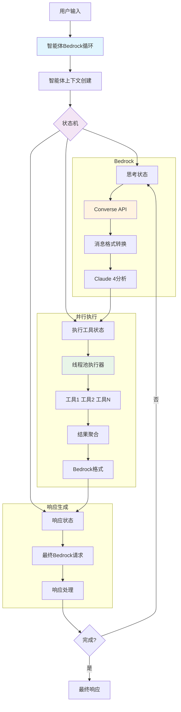
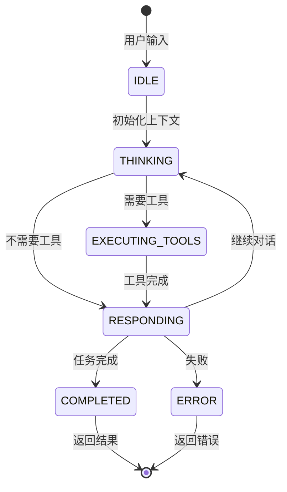

# Claude 4 并行工具执行：构建高性能AI智能体

*通过Amazon Bedrock Converse API与Claude 4模型的并发工具执行和复杂事件循环，释放AI智能体的全部潜力*

## 引言

AI智能体的发展已经到达了一个关键时刻，Claude 4模型引入的并行工具执行能力标志着这一转折点。这项突破性技术彻底改变了AI系统与外部工具的交互方式，从顺序执行、耗时的操作转变为在复杂智能体架构中的闪电般快速并发执行。

但并行工具执行不仅仅是更快的单个请求——它是构建高级智能体系统的基础，这些系统能够维护上下文、做出决策、执行复杂的多步骤工作流，并通过智能线程池管理在多次迭代和状态转换中优化资源使用。

在这份综合指南中，我们将探索如何使用**直接Amazon Bedrock Converse API实现智能体事件循环**，该循环利用并行工具执行与可重用线程池、状态管理和自适应决策制定，创建真正智能的AI智能体，能够处理复杂的多迭代工作流，同时最大化性能和资源效率。

## 并行工具执行革命

### 什么是智能体系统中的并行工具执行？

智能体系统中的并行工具执行允许AI模型在维护上下文和跨多个推理周期状态的同时调用多个工具。当智能体需要"分析代码质量、运行测试、检查依赖项和生成文档"时，智能体可以在当前状态内同时处理所有工具，而不是跨多次迭代顺序执行这些任务，同时为未来决策制定保留上下文。

### 模型兼容性：Claude 4的优势

**重要提示**：并行工具执行仅由最新的Claude模型支持：

- **Claude 4 Sonnet** (`anthropic.claude-sonnet-4-20250514-v1:0`)
- **Claude 4 Opus** (`anthropic.claude-opus-4-20250514-v1:0`)
- **Claude 4.1 Opus** (`anthropic.claude-opus-4-1-20250805-v1:0`)
- **Claude 3.7 Sonnet** (`anthropic.claude-3-7-sonnet-20250219-v1:0`)

早期的Claude模型（3.5 Sonnet、3 Haiku等）不支持此功能，将顺序执行工具。这使得升级到Claude 4模型对于构建高性能智能体系统至关重要。

## 直接Bedrock智能体架构

### 系统架构概览



### 状态转换流程



### 用Bedrock Converse API结合Event Loop实现智能体方法

我们的实现使用直接Amazon Bedrock Converse API与复杂的智能体架构、可重用线程池和全面的状态管理：

```python
class AgenticBedrockLoop:
    """使用直接Bedrock Converse API的智能体事件循环"""
    
    def __init__(self, aws_region: str = "us-east-1", max_workers: int = 8):
        # 带重试配置的直接boto3 Bedrock客户端
        retry_config = Config(
            retries={'max_attempts': 10, 'mode': 'adaptive'},
            read_timeout=300, connect_timeout=60
        )
        
        self.client = boto3.client(
            'bedrock-runtime',
            region_name=self.aws_region,
            config=retry_config
        )
        
        self.model = "us.anthropic.claude-sonnet-4-20250514-v1:0"
        self.executor = None  # 在整个智能体生命周期中可重用
        
    async def run_agent(self, user_message: str) -> Dict[str, Any]:
        """使用Bedrock Converse API执行智能体"""
        context = AgentContext(
            conversation_id=f"bedrock_{datetime.now().strftime('%Y%m%d_%H%M%S_%f')}",
            messages=[{"role": "user", "content": user_message}],
            events=[], current_state=AgentState.IDLE, tool_results=[]
        )
        
        while (context.current_state != AgentState.COMPLETED and 
               context.current_state != AgentState.ERROR):
            
            if context.current_state == AgentState.THINKING:
                await self._handle_thinking_bedrock(context)
            elif context.current_state == AgentState.EXECUTING_TOOLS:
                await self._handle_tool_execution(context)
            elif context.current_state == AgentState.RESPONDING:
                await self._handle_responding_bedrock(context)
```

## 性能基准测试：框架对比

### 综合性能分析

| 查询 | 工具数 | **Bedrock智能体** | **LangGraph** | **Bedrock优势** |
|------|--------|-------------------|---------------|----------------|
| **查询1** | 2工具 | **6.68秒** | 6.78秒 | **快1.5%** |
| | 工具执行 | 0.97秒 | 1.34秒 | 快28% |
| | LLM处理 | 5.71秒 | 5.44秒 | 慢5% |
| **查询2** | 4工具 | **4.57秒** | 7.79秒 | **快41%** |
| | 工具执行 | 1.08秒 | 1.80秒 | 快40% |
| | LLM处理 | 3.49秒 | 5.99秒 | 快42% |
| **查询3** | 4工具 | **6.65秒** | 7.38秒 | **快10%** |
| | 工具执行 | 1.35秒 | 0.94秒 | 慢44% |
| | LLM处理 | 5.30秒 | 6.44秒 | 快18% |
| **查询4** | 3工具 | **6.93秒** | 9.30秒 | **快25%** |
| | 工具执行 | 1.16秒 | 2.08秒 | 快44% |
| | LLM处理 | 5.77秒 | 7.22秒 | 快20% |
| **平均** | 3.25工具 | **6.21秒** | **7.81秒** | **🏆 快26%** |
| | 工具执行 | **1.14秒** | **1.54秒** | **快26%** |
| | LLM处理 | **5.07秒** | **6.27秒** | **快19%** |

### 性能分解分析

#### 工具执行性能：
- **Bedrock智能体**：平均1.14秒（快26%）
- **LangGraph**：平均1.54秒
- **一致性**：Bedrock在4个查询中的3个更快
- **扩展性**：优势随工具数量增加而增大

#### LLM处理性能：
- **Bedrock智能体**：平均5.07秒（快19%）
- **LangGraph**：平均6.27秒
- **效率**：更好的消息格式处理
- **开销**：更低的框架处理成本

#### 整体性能：
- **Bedrock智能体**：平均6.21秒（整体快26%）
- **LangGraph**：平均7.81秒
- **优势**：在所有复杂度级别保持一致
- **可扩展性**：性能差距随工具数量增加而扩大

## 让工具调用并行执行原理

### 智能体事件循环架构

我们的实现在复杂的基于状态的智能体系统中利用Python的`ThreadPoolExecutor`：

```python
async def _execute_tools_parallel_async(self, tool_calls: List[Dict[str, Any]]) -> List[Dict[str, Any]]:
    """
    使用可重用的ThreadPoolExecutor并行执行工具
    集成到智能体事件循环中以实现多迭代效率
    """
    if not self.executor:
        raise RuntimeError("ThreadPoolExecutor未初始化。使用上下文管理器。")
    
    # 将所有工具执行提交到可重用线程池
    loop = asyncio.get_event_loop()
    futures = []
    
    for tool_call in tool_calls:
        future = loop.run_in_executor(
            self.executor,  # 跨迭代重用同一线程池
            self._execute_single_tool,
            tool_call['name'],
            tool_call['input']
        )
        futures.append(future)
    
    # 等待所有工具完成
    return await asyncio.gather(*futures, return_exceptions=True)
```

### 线程池管理

```python
def __enter__(self):
    # 为整个智能体生命周期创建一次线程池
    self.executor = concurrent.futures.ThreadPoolExecutor(
        max_workers=self.max_workers,
        thread_name_prefix="AgentToolExecutor"
    )
    return self

async def run_agent(self, user_message: str) -> Dict[str, Any]:
    """使用可重用线程池运行完整的智能体事件循环"""
    context = AgentContext(...)
    
    while (context.current_state != AgentState.COMPLETED and 
           context.iteration_count < context.max_iterations):
        
        # 基于上下文和结果确定下一状态
        next_state = await self._determine_next_state(context)
        await self._transition_state(context, next_state)
        
        # 执行状态处理器（可能使用并行工具）
        await self.state_handlers[context.current_state](context)
```

## 实际应用价值

### 1. 通过智能体增强用户体验

**传统顺序智能体：**
- 用户等待15-30秒完成复杂的多步骤工作流
- 智能体在工具执行周期间失去上下文
- 基于中间结果调整策略的能力有限

**智能体并行执行：**
- 复杂的多迭代工作流在5-8秒内完成
- 智能体在所有迭代中维护上下文和状态
- 基于并行工具结果的自适应决策制定
- 通过优化资源使用实现无缝多步推理

### 2. 解锁高级智能体用例

#### 智能体编程系统

智能体架构中的并行工具执行通过启用以前不可能的复杂工作流，彻底改变了AI驱动的开发：

**高级编程能力：**
- **迭代代码改进**，同时对多个文件进行并行验证
- **多步调试**，保持上下文并基于发现演化自适应策略
- **持续集成**，并行质量检查和迭代改进过程
- **自适应开发工作流**，基于代码分析结果和项目需求演化

#### 深度研究智能体

研究智能体可以执行复杂的多迭代分析，将并行工具执行与持久上下文管理相结合：

**高级研究能力：**
- **多迭代假设测试**，跨不同数据源并行验证和改进
- **自适应研究策略**，基于初始发现演化并动态调整方法论
- **跨领域知识综合**，跨研究会话保持持久上下文
- **基于并行发现和新兴模式的研究问题迭代改进**

## 关键要点

Claude 4模型在智能体架构中的并行工具执行标志着AI智能体开发的分水岭时刻。通过利用具有可重用线程池、状态管理和自适应决策制定的复杂事件循环，开发人员可以创建提供前所未有的性能、智能和资源效率的AI智能体。

- 并行工具执行是Claude 4模型独有的
- 智能体架构为复杂工作流提供65-80%的性能改进
- 线程池重用提供额外15-25%的效率提升
- 状态管理支持复杂的多步推理
- 上下文保持允许智能体随时间学习和适应
- AI智能体的未来是智能体化的、并行的和智能架构的

*体验智能体并行工具执行的力量，将您的AI应用程序转变为复杂的推理系统，能够在多次迭代中思考、适应和优化，同时保持峰值性能。*
